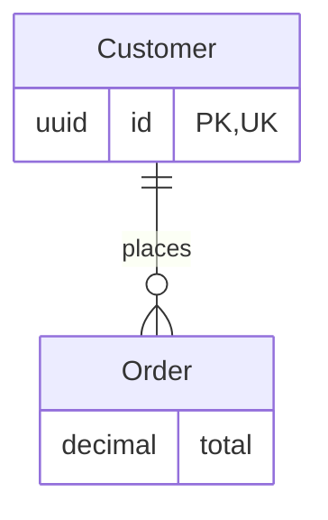
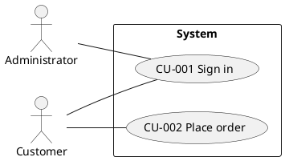

# Incremento 1F — Anexo técnico del motor de diagramas

## 1. Diagram Engine Implementation

`caseflow-svg-v1` es el identificador interno de versión del renderer implementado en `apps/api/src/data-models/diagram-engine.ts`. Es código propio de CASEFlow AI, no una librería de terceros. No se añadió ninguna dependencia; las versiones relevantes siguen siendo TypeScript 5.9.3, Node.js 24 y Zod 4.6.5. No se usa un motor oficial Mermaid ni PlantUML.

Para ER, CASEFlow convierte el modelo estructurado en texto `MERMAID_ER`, lo valida y entrega ese texto a `renderSvg`. Para casos de uso convierte versiones estructuradas en texto `PLANTUML`, lo valida y también lo entrega a `renderSvg`. El renderer no analiza la gramática ni ejecuta Mermaid/PlantUML: divide la fuente validada en líneas, escapa cada línea y la presenta como texto monoespaciado dentro de un SVG fijo. Por ello el SVG representa fielmente el texto de la fuente, pero no produce el layout gráfico oficial ni demuestra compatibilidad completa con los parsers oficiales.

Mermaid y PlantUML se conservan como fuentes editables, legibles, determinísticas y exportables a futuros renderers oficiales. El SVG actual es una previsualización segura de la fuente, no una interpretación visual completa de su semántica.

## 2. Canonical vs Derived Representations

Data Model:

```text
DataModelDetail + DataModelEntity + DataModelAttribute + DataModelRelationship
→ MERMAID_ER determinístico
→ SVG textual caseflow-svg-v1
```

La representación autoritativa es el snapshot relacional del `DATA_MODEL` ArtifactVersion.

Use Case Diagram:

```text
ArtifactVersion USE_CASE APPROVED + UseCaseDetail + actores
→ PLANTUML determinístico
→ SVG textual caseflow-svg-v1
```

Las versiones estructuradas de casos de uso son autoritativas. `DiagramDetail.source` y `DiagramDetail.svg` son derivados reproducibles. Cambiar o eliminar un SVG no altera ninguna entidad, atributo, relación, actor ni caso de uso canónico; las restricciones normales impiden modificar/eliminar el snapshot persistido por los flujos de aplicación.

## 3. Source Format Examples

Mermaid ER representativo:



PlantUML Use Case representativo:



Ambas fuentes son determinísticas para la misma entrada estructurada ordenada. Los casos de uso se ordenan por código y los actores se deduplican y ordenan mediante `localeCompare`; el resultado presupone el mismo runtime/locale efectivo.

## 4. SVG Security

El SVG se construye exclusivamente con una plantilla fija que contiene `svg`, `rect` y `text`. Cada línea completa de fuente pasa por escape XML de `&`, `<`, `>`, comillas dobles y comillas simples. Además, nombres y etiquetas pasan por `quote`, que elimina comillas y saltos de línea antes de incorporarlos a la fuente.

El renderer no emite ni permite estructuralmente:

- `<script>`;
- `foreignObject`;
- atributos `onload`/`onerror`;
- URL `javascript:`;
- `href`, `src` ni recursos externos;
- estilos, fuentes o stylesheets externos;
- HTML embebido arbitrario.

Los nombres de entidades, atributos, actores, casos de uso y etiquetas de relación terminan como texto XML escapado. El flujo productivo genera la fuente desde datos que ya pasaron por Zod y reglas de dominio; no ejecuta fuente devuelta por IA. `renderSvg` es una API interna que recibe texto, aplica una validación básica del formato y nunca ejecuta ese texto, aunque su validador no equivale a un parser completo de Mermaid/PlantUML.

## 5. Data Model Database Structure

Migración: `20260922190000_data_models_diagrams`.

Tablas físicas:

- `data_model_details`: `artifact_version_id`, `model_kind`, `generation_id`, `generation_candidate_id`, `ai_run_id`.
- `data_model_entities`: `id`, `artifact_version_id`, `local_id`, `position`, `name`, `description`.
- `data_model_attributes`: `id`, `entity_id`, `position`, `name`, `type`, `required`, `primary_key`, `unique`, `description`.
- `data_model_relationships`: `id`, `artifact_version_id`, `position`, `source_entity_id`, `target_entity_id`, `name`, cardinalidades y `description`.
- `data_model_generations`: `id`, `project_id`, `ai_run_id`, `created_at`.
- `data_model_generation_sources`: `generation_id`, `artifact_version_id`, `source_id`.
- `data_model_candidates`: `id`, `generation_id`, `candidate_id`, `title`, `model_kind`, payload candidato `entities`/`relationships`, `accepted_artifact_id`.
- `diagram_details`: `artifact_version_id`, `kind`, `source_format`, `generator_version`, `source`, `svg`.
- `diagram_source_versions`: `diagram_version_id`, `source_artifact_version_id`.

Enums de PostgreSQL:

- `data_model_kind`: `ER`.
- `conceptual_attribute_type`: `STRING`, `TEXT`, `INTEGER`, `DECIMAL`, `BOOLEAN`, `DATE`, `DATETIME`, `UUID`.
- `data_model_cardinality`: `ONE`, `ZERO_OR_ONE`, `ONE_OR_MORE`, `ZERO_OR_MORE`.
- `diagram_kind`: `ER`, `USE_CASE`.
- `diagram_source_format`: `MERMAID_ER`, `PLANTUML`.

Restricciones relevantes:

- unicidad de `local_id`, posición y nombre por versión de modelo;
- unicidad case-insensitive de nombre de entidad y atributo mediante índices sobre `lower(btrim(name))`;
- una sola fila `primary_key=true` por entidad;
- posiciones únicas de atributos y relaciones;
- FKs compuestas de endpoints de relación a `(entity_id, artifact_version_id)`, evitando relaciones cruzadas entre snapshots;
- `ai_run_id` único por generación, fuentes únicas y `candidate_id` único por generación;
- triggers que exigen tipo `DATA_MODEL`, procedencia coherente, fuentes `APPROVED` del mismo proyecto y tipo permitido, y aceptación en el proyecto/tipo correcto;
- checks de valores no vacíos, posición no negativa y correspondencia `ER/MERMAID_ER` o `USE_CASE/PLANTUML`;
- trigger de fuentes de diagrama que exige mismo proyecto, ER autorreferenciado a la versión `DATA_MODEL`, y casos de uso `APPROVED`;
- triggers de inmutabilidad sobre detalles, entidades, atributos, relaciones, detalles de diagrama y enlaces de fuente.

## 6. Data Model Semantics

Tipos conceptuales: `STRING`, `TEXT`, `INTEGER`, `DECIMAL`, `BOOLEAN`, `DATE`, `DATETIME`, `UUID`.

Cardinalidades: `ONE`, `ZERO_OR_ONE`, `ONE_OR_MORE`, `ZERO_OR_MORE`.

- Claves primarias compuestas: no soportadas en 1F; se admite como máximo un atributo PK por entidad.
- Relaciones autorreferenciadas: permitidas.
- Varias relaciones entre el mismo par de entidades: permitidas; la posición es la identidad ordenada dentro del snapshot.
- Nombre de relación: opcional, no vacío cuando existe.
- Nombres de entidad: únicos tras `trim` y normalización case-insensitive en Zod; el DB refuerza `lower(btrim(name))`.
- Nombres de atributo: la misma regla, acotada a su entidad.

## 7. AI Generation

- Prompt: `data-model.generate@1`.
- `maxOutputTokens`: `12288`.
- Requirements elegibles: ArtifactVersion exacta, tipo `REQUIREMENT`, estado `APPROVED`, mismo proyecto.
- Use Cases elegibles: ArtifactVersion exacta, tipo `USE_CASE`, estado `APPROVED`, mismo proyecto.
- Máximos de entrada: 100 Requirement version IDs y 100 Use Case version IDs; al menos una fuente y sin duplicados combinados.
- Una generación devuelve entre 1 y 5 modelos candidatos.
- Cada candidato admite hasta 60 entidades, 50 atributos por entidad y 150 relaciones.
- Zod estricto y `superRefine` verifican IDs temporales únicos, nombres normalizados únicos, PK única por entidad y endpoints existentes. No existe una segunda validación de entidades posterior a Zod; la validación semántica está integrada en el esquema Zod y el servicio valida por separado las fuentes exactas.
- Una relación hacia una entidad candidata inexistente produce `AI_INVALID_OUTPUT` en `AIOrchestrator`; no se persiste el batch ni un Artifact oficial.

## 8. Acceptance / Versioning

La aceptación carga el candidato persistido, lo revalida, crea transaccionalmente un Artifact `DATA_MODEL` con prefijo `MD`, versión 1 `AI_GENERATED/GENERATED`, snapshot normalizado, diagrama ER derivado y enlace de aceptación. Una falla revierte toda la transacción.

La creación manual produce `MANUAL/DRAFT`. Editar crea ArtifactVersion N+1, inserta nuevas filas de detalle/entidad/atributo/relación y conserva intactas las anteriores. La secuencia N+1 bloquea la fila Artifact con `SELECT ... FOR NO KEY UPDATE`, lee la versión máxima dentro de la misma transacción y conserva el índice único `(artifact_id, version_number)` como respaldo.

## 9. Diagram Artifacts

ER:

- Artifact type: `DATA_MODEL`; no existe un Artifact ER separado.
- Origin/status: los de la versión del modelo (`MANUAL/DRAFT` o `AI_GENERATED/GENERATED`).
- El `DiagramDetail` pertenece a esa misma ArtifactVersion y se versiona junto con ella.
- Una nueva versión manual del modelo crea un nuevo snapshot y un nuevo detalle derivado; no hay endpoint de regeneración aislada.
- Fuente exacta persistida: la misma DATA_MODEL ArtifactVersion.

Use Case:

- Artifact type: `USE_CASE_DIAGRAM`.
- Origin/status actual: `MANUAL/GENERATED`, porque la derivación es determinística y no usa IA.
- Cada llamada de generación crea un Artifact y ArtifactVersion nuevos; no agrega una versión al diagrama anterior.
- Fuentes exactas: todas las ArtifactVersions `USE_CASE/APPROVED` suministradas.

Se permite regenerar sin cambios y crear duplicados. Si una fuente cambia posteriormente, el diagrama histórico no se modifica ni se marca automáticamente; conserva sus enlaces exactos. Impact Analysis sigue diferido.

## 10. Use Case Diagram Semantics

La fuente PlantUML incluye límite de sistema (`rectangle`), actores, casos de uso con código estable `CU-*`, y asociaciones para actor principal y todos los secundarios. No inventa `<<include>>`, `<<extend>>` ni generalización.

Los actores se deduplican por igualdad exacta de string, sensible a mayúsculas/acentos/espacios ya normalizados por los contratos. Luego se ordenan con `localeCompare`. Las asociaciones se generan desde cada lista de actores; si el mismo actor aparece repetido dentro de un caso por datos históricos anómalos, no existe una deduplicación adicional por caso.

## 11. API Routes

- `POST /projects/{projectId}/data-models` — crear modelo manual.
- `GET /projects/{projectId}/data-models` — listar modelos actuales.
- `GET /projects/{projectId}/data-models/{dataModelId}` — consultar modelo actual.
- `POST /projects/{projectId}/data-models/{dataModelId}/versions` — crear versión manual N+1.
- `POST /projects/{projectId}/data-models/generate` — generar candidatos desde fuentes aprobadas exactas.
- `GET /projects/{projectId}/data-models/generations/{generationId}` — recuperar batch/candidatos.
- `POST /projects/{projectId}/data-models/generations/{generationId}/accept` — aceptar candidatos.
- `GET /projects/{projectId}/data-models/{dataModelId}/diagram` — obtener fuente/SVG ER de la versión actual.
- `POST /projects/{projectId}/diagrams/use-cases` — crear diagrama desde casos aprobados exactos.
- `GET /projects/{projectId}/diagrams/use-cases/{diagramId}` — consultar diagrama persistido.

## 12. Test Detail

Resultado global verificado: 141 unit tests y 65 integration tests.

Cobertura específica existente:

- fuente ER determinística: `diagram-engine.spec.ts` genera dos veces y compara igualdad;
- fuente Use Case determinística: orden de códigos, deduplicación de actores y ausencia de include/extend;
- SVG: formato, escape indirecto y ausencia de `<script` en el resultado probado;
- errores del renderer: rechazo de fuente Mermaid malformada y directivas PlantUML inseguras;
- aislamiento: fuentes draft, de tipo incorrecto y cross-project rechazadas en integración/servicio;
- procedencia: integración verifica IDs exactos de Requirement/Use Case y cadena AIRun/generación;
- inmutabilidad: integración verifica que una nueva versión conserva entidades anteriores; los triggers se aplicaron y migraron correctamente;
- concurrencia: la estrategia común Artifact usa bloqueo e índice único, pero no existe un test concurrente específico de `DataModelsService.version`;
- cardinalidades/referencias: contratos rechazan cardinalidad fuera del enum y endpoint candidato inexistente;
- `AI_INVALID_OUTPUT`: cubierto por `AIOrchestrator` y contratos; no existe todavía un test de integración 1F dedicado que inyecte una respuesta AI inválida y compruebe el código HTTP;
- shell/red: el código no contiene subprocess ni cliente HTTP en el renderer; el test rechaza directivas de inclusión, pero no usa spies de proceso/red porque esas dependencias no existen.

Limitaciones de cobertura concretas: no hay prueba maliciosa dedicada para cada vector SVG (`foreignObject`, eventos, URL externa), no hay actualización SQL directa dedicada contra cada tabla 1F y no hay test concurrente 1F específico. La seguridad principal deriva de la plantilla fija y el escape XML, además de los triggers.

## 13. OpenAPI

Se añadieron 10 operaciones. Los cinco cuerpos de request nuevos usan esquemas Zod compartidos mediante `ApiZodBody`; las respuestas tipadas de Data Model y Diagram usan `ApiZodResponse`. Los endpoints de batch de generación/aceptación no documentan todavía un esquema Zod de respuesta específico, siguiendo el patrón previo de generaciones.

La generación OpenAPI continúa siendo determinística en las verificaciones del repositorio y el test comprueba rutas y `operationId` únicos. El archivo generado no está versionado; por tanto se valida por regeneración, no mediante un diff byte-a-byte almacenado en Git.

## 14. Known Limitations

- `caseflow-svg-v1` muestra la fuente como texto SVG; no realiza layout gráfico ER/UML.
- No se ha validado la fuente contra parsers oficiales Mermaid o PlantUML; compatibilidad sintáctica completa no está garantizada.
- No se utiliza renderer oficial, CLI, contenedor ni servicio Mermaid/PlantUML.
- El SVG se valida como XML fijo en backend, pero no se probó montándolo en un navegador real ni con una política CSP frontend.
- No hay UI de diagramas en 1F.
- No se soportan PK compuestas, UML include/extend/generalización ni relaciones de clases.
- Diagramas grandes producen SVG textual alto, limitado a 10 000 px; el contenido posterior puede quedar fuera del viewport calculado.
- El SVG y la fuente se guardan en tablas; migración a `StorageProvider` está diferida.
- Regenerar el mismo conjunto de fuentes puede crear diagramas duplicados.
- Cambios posteriores de fuentes no disparan regeneración ni análisis de impacto.
- La deduplicación de actores es exacta, no semántica/case-insensitive.
- El validador de fuente es deliberadamente pequeño y no sustituye una gramática oficial.
